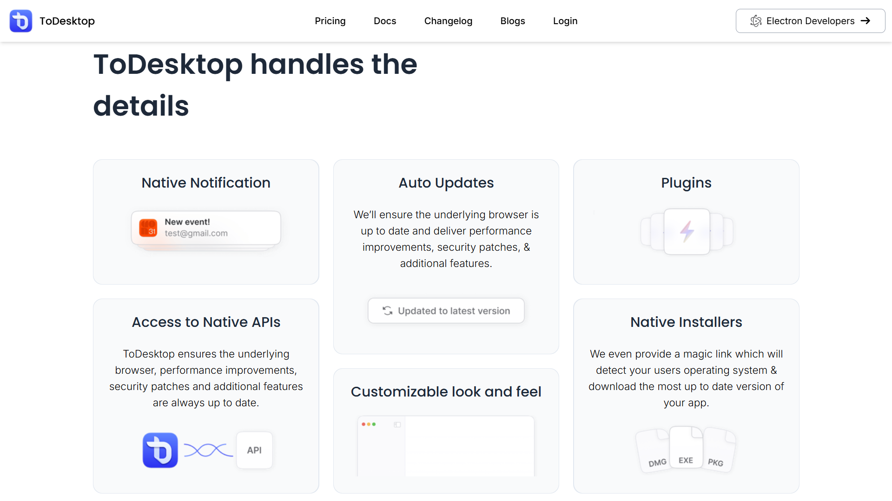
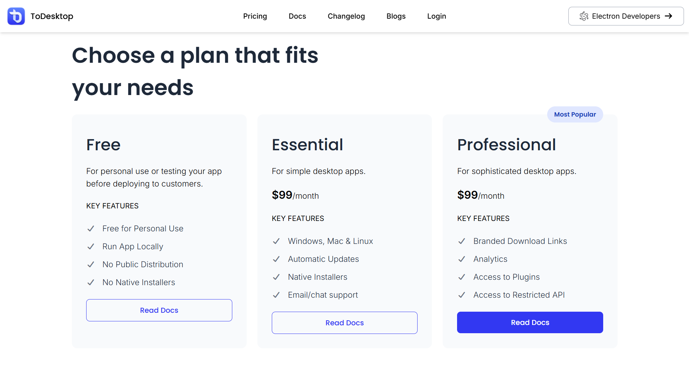
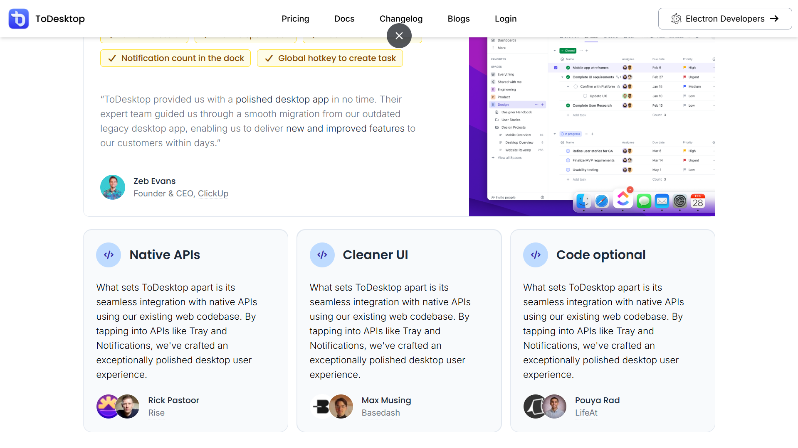

  
# 🚀 ToDesktop - Web to Desktop Magic ✨

**A modern and responsive ToDesktop landing page clone built using React JS and Tailwind CSS.
This project recreates the sleek, minimal, and SaaS-style UI of the official ToDesktop website with clean components, smooth layouts, and a fully responsive design.**

## 🎨 Screenshots

| 🖥️ **Hero Section** | 🌟 **Feature Grid** |
|---|---|
|  |  |

| 💳 **Pricing** | 🗣️ **Testimonials** |
|---|---|
|  |  |

## ✨ Download Overview

**🔥 Single-Page Application with these killer sections:**

- **📱 Navbar** - Responsive navigation with CTA buttons
- **🎯 Hero Section** - Animated company logos & value prop
- **⚡ How It Works** - 3-step conversion process
- **🎨 Feature Grid** - Bento-style native features showcase
- **⭐ Customer Stories** - ClickUp testimonials & case studies
- **💰 Pricing** - Free, Essential, Professional plans
- **❓ FAQ** - Common questions answered
- **📄 Footer** - Docs, socials & company info

## 🛠️ Tech Stack

